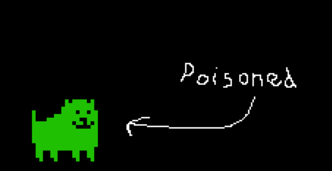

a little program to mimic the communication method Toby Fox had going on during the Undertale 10th Anniversary Livestream

# Download
download the program from the Releases tab
- **full_radiation**: the whole package, with speech to text, pressing Z to flip, and pressing X to poison yourself
- **just_speech**: just the speech to text

# Run it from Source
when ran from source, you have access to the console, which means you can type things in to make Toby say sommething more precise
- install python 3.11+
- install pip
- pip install everything in requirements.txt
- run either full_radiation.py or just_speech.py

have fun :)
